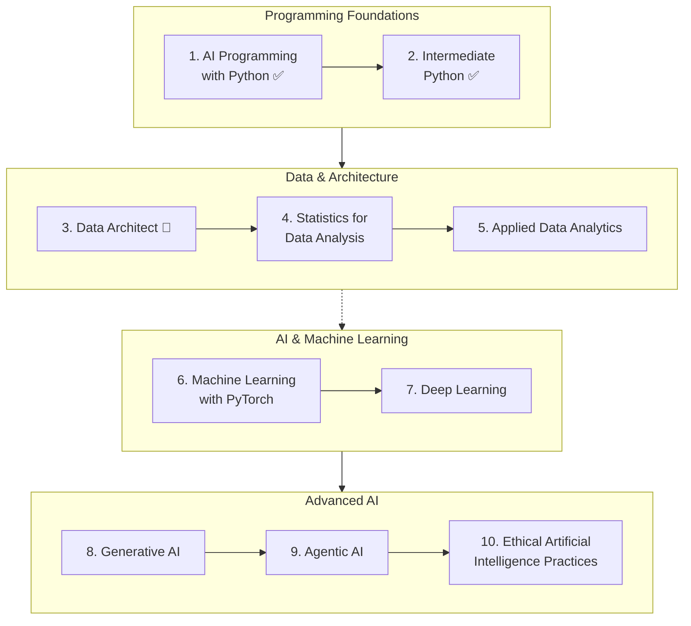
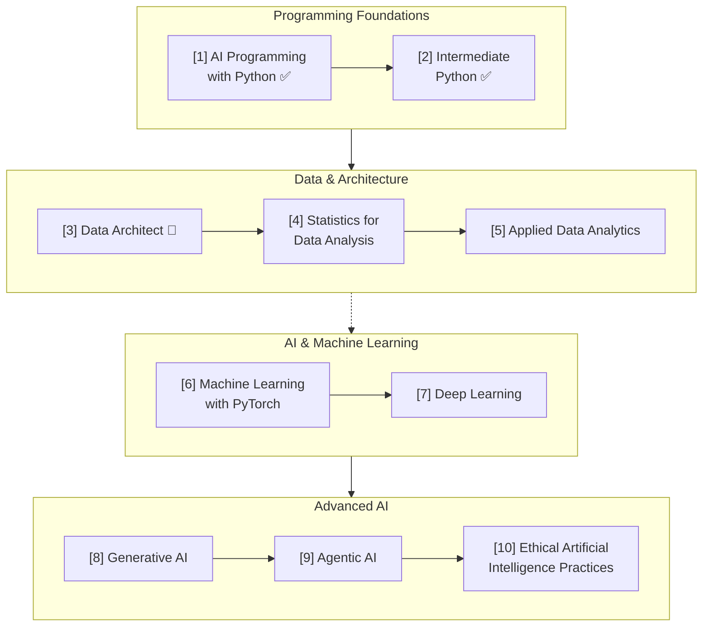

# MSc Artificial Intelligence Portfolio

A practical portfolio documenting my journey through the Udacity Institute of AI & Technology Master of Science in Artificial Intelligence, delivered in partnership with Woolf University.

This repository contains hands-on projects, notebooks, exercises, and supporting material across AI, Python, data architecture, and modern AI-assisted development workflows.

---

## About the MSc Programme

The MSc programme combines core and elective Nanodegree programmes covering AI, machine learning, deep learning, generative AI, data science, and data architecture.

---

# Current Progress

## Core Nanodegree Programmes

| Module                                    | Status      |
| ----------------------------------------- | ----------- |
| AI Programming with Python                | ✅ Completed |
| Statistics for Data Analysis              | ⏳ Upcoming  |
| Applied Data Analytics                    | ⏳ Upcoming  |
| Machine Learning with PyTorch             | ⏳ Upcoming  |
| Deep Learning                             | ⏳ Upcoming  |
| Generative AI                             | ⏳ Upcoming  |
| Agentic AI                                | ⏳ Upcoming  |
| Ethical Artificial Intelligence Practices | ⏳ Upcoming  |

## Elective Programmes

| Module | Status |
|---|---|
| Intermediate Python | ✅ Completed |
| Data Architect | 🚧 In Progress |

---
## MSc AI Learning Roadmap
> 📌 The roadmap below reflects my planned progression. Modules are intentionally ordered to reflect a structured learning path from programming foundations through to machine learning, generative AI, and advanced agentic systems.

---

# Purpose of this Repository

This repository serves as:

- a technical learning portfolio
- a collection of practical AI and data projects
- a record of my MSc journey
- a space to explore modern AI-assisted development and engineering workflows

The portfolio combines:

- enterprise architecture thinking
- hands-on coding and experimentation
- notebook-driven learning
- structured technical documentation
- AI-assisted development workflows

> ⚡The goal is not only to complete coursework, but to build practical implementation skills, reusable engineering patterns, and a deeper understanding of modern AI systems.